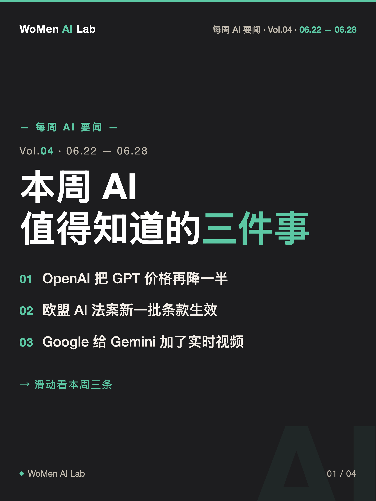
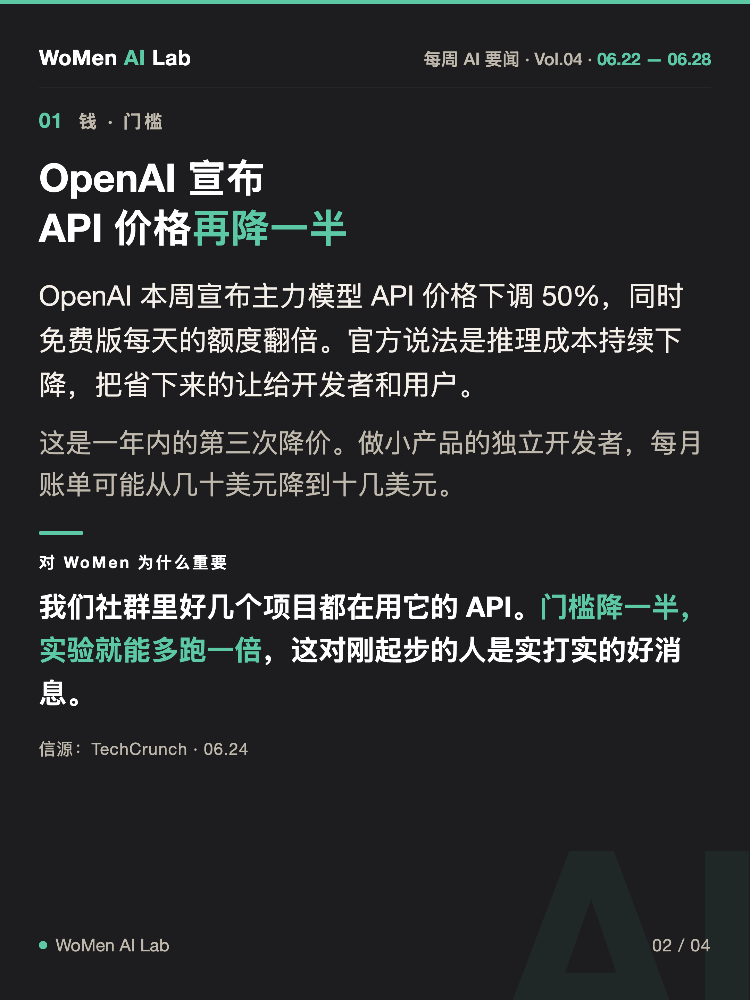

# womenai-weekly-news

WoMen AI Lab 每周 AI 要闻卡片 — 一个 [Claude Code](https://claude.com/claude-code) skill。

每期自动完成：搜索最近一个完整自然周（周一到周日）最重要的 3 条 AI 新闻 → 按 WoMen AI Lab 的语言风格写文案 → 套固定视觉母版渲染成 **1 封面 + 3 内容卡**，共 4 张 2160×2880 PNG，可直接发小红书。

| 封面 | 内容卡 |
|---|---|
|  |  |

> 示例图为版式演示，新闻内容为虚构。

## 安装

```bash
git clone https://github.com/ruthless-coder-ai/womenai-weekly-news.git ~/.claude/skills/womenai-weekly-news
```

依赖：Python 3 + [Playwright](https://playwright.dev/python/)（chromium）。Linux 环境渲染中文需先装 `fonts-noto-cjk`。

## 使用

在 Claude Code 里说一句即可触发：

- 「做这周的 AI 要闻」
- 「出 Vol.05」
- 「总结上周 AI 新闻做成图」

第一次运行会询问期号，之后从输出文件夹自动 +1。交付时会列出三条新闻的标题和信源，说「第 X 条换成 XX」即可重做。

## 设计原则

- **母版锁死**：字体栈、配色（深炭黑 `#1D1D1F` + 薄荷绿 `#5CC8A4` + 米色 `#F4EFE9`）、页眉页脚、水印全部固化在 `assets/style.css` 和渲染脚本里，每期长得一样，只换字。
- **选稿三角度**：钱/成本、人/工作/社会、工具/模型各一条，偏普通人有切身感的新闻，不选融资估值人事。
- **风格红线**：标题带大厂名，正文客观不人格化，只有「对 WoMen 为什么重要」用「我们」口吻，不用引号强调、不用破折号、不用「不是A而是B」句式。完整规范见 [references/editorial-guide.md](references/editorial-guide.md)。
- **溢出自检**：渲染脚本自动检测文字溢出并警告，提示精简文案而不是改母版。

## 目录结构

```
womenai-weekly-news/
├── SKILL.md                      # skill 入口：流程 + news.json schema
├── assets/style.css              # 视觉母版（锁死）
├── references/editorial-guide.md # 选稿标准 + 语言风格 + 常见问题
└── scripts/build_news_cards.py   # JSON → 4 张 PNG（Playwright 渲染）
```
